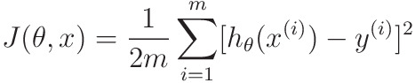
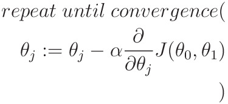

# Linear Regression in One Variable

Linear Regression is the Machine learning Model, through which we can find correlation between dependant variables and independent variables. and then use this correlation to predict value of dependant variables from independent variables.

Consider we have a dataset of 97 data points,each with the following two values:

-   Population of City
-   Profit of City

Under the assumption that the Population brings Profit, let the independent value be the population (let it be x), and the dependant value be profit (let it be y)

Before making further assumptions, lets look at the datasets's scatter plot:

From the scatter plot we can guess that there will be a linear correlation between y and x (you can also assume x2, but continuing with x)

## Hypothesis function

consider a hypothesis function, which predicts y with x as input

we have to tune &theta;0 and &theta;1 such that the line generated will be the "best fit" for the dataset given.

## How to find the "best fit" ?

consider a cost function, which essentially calculates the distance between what we need the line to be, and what it actually is:

where

-   m -> number of elements in the dataset
-   x(i) -> value of x in ith data point
-   y(i) -> value of y in ith data point

now we have to tune &theta;0 and &theta;1 such that J(&theta;,x) is minimum

## How to Minimize the Cost Function?

To minimize the cost function J(&theta;,x), we use something called gradient descent.

Gradient Descent is an iterative way through which we can minimize the cost function J(&theta;,x), which essentially depends on the values of &theta;0 and &theta;1

Gradient Descent is implemented as follows:

where

-   &alpha; -> a constant, also called learning rate of algorithm
-   &theta;j -> jth value of &theta;
-   J( &theta;0 , &theta;1 ) -> The Cost Function

this algorithm iteratively minimizes J(&theta; ,x) to reach it's minimum possible value

## End Result

For the given scatter plot of data, using gradient descent, we found the following line that gives us the "best fit" for the dataset

now using this hypothesis function, we can predict value for y, given x

## Implementation Notes

As this model is very calculation driven, I have decided to implement these algorithm using matrices, as inbuilt matrix operation are faster than tradition nested loops.

So following changes were made to the algorithm:

1. X is modified to 2x1 matrix by appending 1 to every data point

2. Modified Hypotheses

-   X -> mx2 matrix
-   &theta; -> 2x1 matrix
-   m -> dataset size
-   Outputs mx2 matrix

3. Modified Cost Function

-   m -> dataset size
-   h(&theta;, X) and Y -> mx1 matrix
-   Outputs 1x1 matrix

4. Modified Gradient Descent (for this cost function)

-   m -> dataset size
-   X -> mx2 matrix
-   h(&theta;, X) and Y -> mx1 matrix

## Additional Notes

1. Value of &alpha;
    - if it's too low, it will take a lot of time Minimization to take place
    - if it's too high, minimization can overshoot, resulting in cost function not minimizing
    - Method to how to proceed:
        - plot values of J during gradient descent, ideally it should decrease
        - Example Plot: 

So, thats the End, Have a great day, and continue learning 😁.
